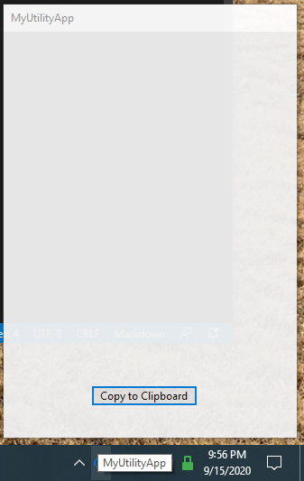
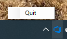

# Windows Forms Utility App Template with Notification Tray Launcher

This is an easy launching point for new Utility apps you may want to create for various purposes.

## Features

* Context menu opens on right click of notify icon

    

* Form opens with single click on notify icon
* Form hides when focus lost
* Form opens by Notification Tray area

## Frameworks

* .NET Core 3.1
* WinForms

## To Do

* MSIX packaging?

## Credits

* [Doing a NotifyIcon Program the Right Way](https://www.codeproject.com/tips/627796/doing-a-notifyicon-program-the-right-way) (2013)